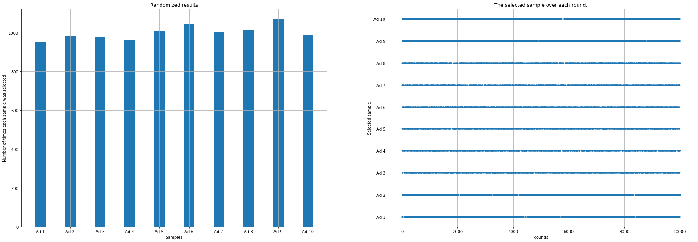

Examples
########

This page provides examples of using the thompson package to solve multi-armed bandit problems.

Thompson Sampling Example
===========================

In this example, we use Thompson Sampling to determine which advertisement performs best. We load a dataset containing 10,000 samples and 10 different ads, where each sample represents a user's response (1 for click, 0 for no click).

.. code:: python

	# Import library
	import thompson as th

	# Load example data
	df = th.import_example()

	# Apply Thompson sampling
	results = th.thompson(df)

	# Plot results
	fig = th.plot(results)

The plot shows:
- The log rewards for each ad (left panel)
- The selection pattern over time (right panel)

.. |fig1| image:: ../figs/fig_thompson.png

.. table:: Thompson Sampling Results
   :align: center

   +----------+
   | |fig1|   |
   +----------+

Upper Confidence Bound (UCB) Example
=======================================

In this example, we use the UCB algorithm to solve the same advertisement optimization problem. The UCB algorithm balances exploration and exploitation using confidence bounds.

.. code:: python

	# Import library
	import thompson as th

	# Load example data
	df = th.import_example()

	# Apply UCB algorithm
	results = th.UCB(df)

	# Plot results
	fig = th.plot(results)

The plot shows:
- The log number of selections and rewards for each ad (left panel)
- The selection pattern over time (right panel)

.. table:: UCB Algorithm Results
   :align: center

   +----------+
   | |fig2|   |
   +----------+

Randomized Sampling Example
============================

In this example, we use randomized sampling as a baseline for comparison. This method randomly selects ads without considering their past performance.

.. code:: python

	# Import library
	import thompson as th

	# Load example data
	df = th.import_example()

	# Apply randomized sampling
	results = th.UCB_random(df)

	# Plot results
	fig = th.plot(results)

The plot shows:
- The distribution of selections across ads (left panel)
- The random selection pattern over time (right panel)

.. table:: Randomized Sampling Results
   :align: center

   +----------+
   | |fig3|   |
   +----------+

Comparing Methods
===================

To compare the performance of different methods, you can run all three algorithms and compare their total rewards:

.. code:: python

	# Import library
	import thompson as th

	# Load example data
	df = th.import_example()

	# Run all methods
	results_ts = th.thompson(df)
	results_ucb = th.UCB(df)
	results_rand = th.UCB_random(df)

	# Compare total rewards
	print(f"Thompson Sampling total reward: {results_ts['total_reward']}")
	print(f"UCB total reward: {results_ucb['total_reward']}")
	print(f"Randomized total reward: {results_rand['total_reward']}")

This comparison helps understand the relative performance of each method in terms of total rewards obtained.

.. include:: add_bottom.add