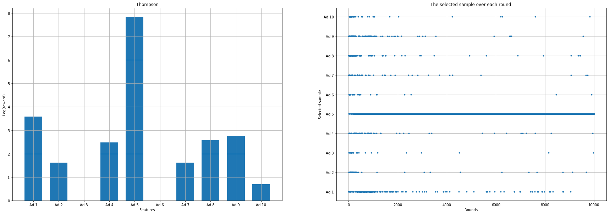

Thompson
################################################

In the following example we load the boolean **ad** dataset containing 10.000 samples and 10 features (ads).
We will investigate which **ad** was most succesful.

.. code:: python

	# Import library
	import thompson as th

	# Load example data
	df = th.import_example()

	# Compute which ad is best using multi-armed bandits
	results = th.thompson(df)

	# Plot
	fig = th.plot(results)

.. table:: Compute rewards per ad using Thompson
   :align: center

   +----------+
   | |fig1|   |
   +----------+

UCB-Upper confidence Bound
################################################

In the following example we load the boolean **ad** dataset containing 10.000 samples and 10 features (ads).
We will investigate which **ad** was most succesful.

.. code:: python

	# Import library
	import thompson as th

	# Load example data
	df = th.import_example()

	# Compute which ad is best using multi-armed bandits
	results = th.UCB(df)

	# Plot
	fig = th.plot(results)

.. |fig2| image:: ../figs/fig_ucb.png

.. table:: Compute rewards per ad using UCB-Upper confidence Bound.
   :align: center

   +----------+
   | |fig2|   |
   +----------+

Randomized data
################################################

In the following example we load the boolean **ad** dataset containing 10.000 samples and 10 features (ads).
We will investigate which **ad** was most succesful when randomizing the data.

.. code:: python

	# Import library
	import thompson as th

	# Load example data
	df = th.import_example()

	# Compute which ad is best using multi-armed bandits
	results = th.UCB_random(df)

	# Plot
	fig = th.plot(results)

.. |fig3| image:: ../figs/fig_ucb_random.png

.. table:: Compute rewards per ad using randomized data.
   :align: center

   +----------+
   | |fig3|   |
   +----------+

.. raw:: html

	

	

		
	

	

